# pktstat-bpf

[](https://github.com/dkorunic/pktstat-bpf/blob/master/LICENSE)
[](https://github.com/dkorunic/pktstat-bpf/releases/latest)


## About

pktstat-bpf is a lightweight replacement for the ncurses/libpcap-based [pktstat](https://github.com/dleonard0/pktstat), powered by Linux eBPF ([extended Berkeley Packet Filter](https://prototype-kernel.readthedocs.io/en/latest/bpf/)). It can gather packet statistics even under **very high traffic volumes** — typically several million packets per second on an average server. In high-volume scenarios such as DoS attacks, traditional packet capture solutions often become unreliable due to packet loss; eBPF-based capture is a more robust alternative.

At the end of execution, the program displays per-IP and per-protocol statistics — including L7 protocol identification for HTTP, TLS, QUIC, SSH, RDP, PostgreSQL, MQTT, WireGuard, and Memcached — sorted by per-connection bitrate, packet count, and (source IP:port, destination IP:port) tuples.

The program consists of [eBPF code written in C](bpf/) and a pure-Go userland component that parses and displays final IP/port/protocol/bitrate statistics. The Go component uses the [cilium/ebpf](https://github.com/cilium/ebpf) library to load and run the eBPF program and to interact with the eBPF map.

By default, the eBPF component uses **TC** (Traffic Control) eBPF hooks with TCX attaching, requiring at minimum Linux kernel **v6.6**, and collects both ingress and egress traffic statistics for TCP, UDP, ICMPv4, ICMPv6, ARP, IPSEC (ESP and AH), GRE, and OSPF. It can also switch to the faster [XDP](https://github.com/xdp-project/xdp-tutorial) (eXpress Data Path) hook at the cost of **losing egress statistics**, since XDP operates only in the ingress path. XDP mode requires at minimum Linux kernel **v5.9** due to its program-to-interface attachment API. Some distributions (notably Red Hat Enterprise Linux) have backported XDP/TC patches, so the eBPF program may work on older kernels as well (see Requirements for details).

Alternatively, the tool can use **KProbes** to monitor TCP, UDP, ICMPv4, and ICMPv6 traffic across all containers, Kubernetes pods, NAT translations, and forwarded flows. In this mode, it also displays the process ID, process name, and cgroup path for traffic sent or delivered to a userspace application. KProbes operate closest to userspace and therefore have the highest overhead, but they provide uniquely useful process-level visibility. The hard dependency for KProbes is a [BTF-enabled](https://docs.ebpf.io/concepts/btf/) kernel. The program resolves kernel-level cgroup IDs to cgroup paths (under `/sys/fs/cgroup`) by scanning the cgroup filesystem and consuming kernel cgroup mkdir events via [dedicated eBPF code](bpf/cgroup.bpf.c).

It is also possible to monitor a specific **cgroup** directly, with full support for both ingress and egress traffic. You can monitor all traffic by attaching to the root cgroup (e.g. `/sys/fs/cgroup`). Process tracking is available in cgroup mode, but only for traffic whose socket creation was observed by pktstat-bpf.


## Architecture

The diagram below sketches the two layers of pktstat-bpf. The Go userland (built on [cilium/ebpf](https://github.com/cilium/ebpf)) selects one of four mutually-exclusive capture modes, patches load-time constants on the corresponding BPF spec (`cgrpfs_magic`, `arp_enabled`, map `MaxEntries`), attaches the program(s) to the right kernel surface, and then reads data back through two BPF maps: `pkt_count` (per-CPU LRU hash of per-flow counters) and `flow_app_proto` (non-per-CPU LRU hash of L7 protocol labels keyed by 5-tuple). Every `bpf/*.c` program `#include`s `bpf/counter_common.h`, which is where `statkey` / `statvalue` / `flowkey`, both maps, `sniff_app_proto`, and the protocol parsers live — that shared header is what lets `map.go` consume every mode through a single type.

```mermaid
flowchart TB

  subgraph user["Userland (Go, package main)"]
    direction LR
    mainEntry["<b>main.go</b><br/>mode select &amp; load<br/>cgroup &gt; kprobes &gt; xdp &gt; tc<br/>applies load-time patches:<br/>cgrpfs_magic / arp_enabled / map MaxEntries"]
    probe["<b>probe.go</b><br/>startTC / startXDP / startKProbes<br/>startCgroup / startCGroupTrace"]
    mapr["<b>map.go</b><br/>BatchLookup + iterator fallback<br/>sumPerCPUValue · commIntern<br/>readFlowAppProto[Batch] · statkeyToFlowkey"]
    cgrouply["<b>cgroup.go</b><br/>cgroup-id &#8594; path cache<br/>perf reader + /sys/fs/cgroup walk"]
    output["<b>output.go</b><br/>processMap, sorters<br/>JSON / Plain<br/>decodes ARP/ESP/AH/GRE/OSPF"]
    tui["<b>tui.go</b><br/>rivo/tview interactive<br/>--refresh, sort keys 0..4"]
  end

  subgraph maps["BPF maps &#8212; kernel &#8596; userland surface"]
    direction LR
    pktcnt[("<b>pkt_count</b><br/>LRU_PERCPU_HASH<br/>statkey &#8594; statvalue<br/>per-CPU; summed on read")]
    flowproto[("<b>flow_app_proto</b><br/>LRU_HASH<br/>flowkey &#8594; uint8<br/>non-per-CPU; L7 label per 5-tuple")]
    sockinfo[("<b>sock_info</b><br/>cookie &#8594; {pid, comm}<br/>cgroup_skb mode only")]
    perf[("<b>cgroup_events</b><br/>PERF_EVENT_ARRAY<br/>cgroup_mkdir events")]
  end

  subgraph ebpf["eBPF programs (bpf/*.c, embedded via bpf2go)"]
    direction TB
    common["<b>counter_common.h</b> &#8212; shared parser core<br/>statkey / statvalue / flowkey<br/>pkt_count (PERCPU LRU) + flow_app_proto (LRU) maps<br/>sniff_app_proto · detect_and_cache_l7 (always_inline)<br/>detect_and_cache_l7_skb / extract_tcp_flowkey_skb (noinline)<br/>process_eth &#8594; process_ip4 / process_ip6<br/>parse_arp / parse_esp / parse_ah / parse_gre / parse_ospf<br/>process_l4_skb (noinline) · VLAN/QinQ unwrap<br/>load-time consts: cgrpfs_magic, arp_enabled"]
    tc["<b>tc.bpf.c</b><br/>TCX ingress + egress<br/>kernel &#8805; 6.6"]
    xdp["<b>xdp.bpf.c</b><br/>ingress only<br/>kernel &#8805; 5.9"]
    kprobe["<b>kprobe.bpf.c</b><br/>14 kprobes<br/>(TCP / UDP / ICMP / IP)<br/>PID + cgroup attribution"]
    cskb["<b>cgroup_skb.bpf.c</b><br/>cgroup_skb ingress/egress<br/>sock_create / sock_release"]
    ctrace["<b>cgroup.bpf.c</b><br/>raw_tracepoint/cgroup_mkdir"]
    tc -.- common
    xdp -.- common
    kprobe -.- common
    cskb -.- common
  end

  subgraph kernel["Kernel attach surfaces"]
    direction LR
    nic{{"NIC RX / TX path<br/>(driver, XDP, TC qdisc)"}}
    l4fns{{"Kernel L4 / IP funcs<br/>tcp_sendmsg, tcp_cleanup_rbuf,<br/>tcp_retransmit_skb,<br/>ip{6}_send_skb, skb_consume_udp,<br/>__icmp_send, icmp{v6}_rcv,<br/>ip{6}_local_out, ip{v6}_rcv"}}
    inet_sk{{"inet_sock_create<br/>inet_sock_release"}}
    cg_mk{{"cgroup_mkdir<br/>raw tracepoint"}}
  end

  mainEntry --> probe
  mainEntry -.->|"load-time patch via spec.Variables"| common

  probe -->|"AttachTCX"| tc
  probe -->|"AttachXDP"| xdp
  probe -->|"link.Kprobe &#215; 14"| kprobe
  probe -->|"AttachCgroup"| cskb
  probe -->|"AttachRawTracepoint"| ctrace

  tc --> nic
  xdp --> nic
  kprobe --> l4fns
  cskb --> inet_sk
  cskb --> nic
  ctrace --> cg_mk

  common ==>|"update_val (per-CPU)"| pktcnt
  common ==>|"detect_and_cache_l7[_skb]"| flowproto
  cskb ==>|"cookie write"| sockinfo
  ctrace ==>|"perf_event_output"| perf

  pktcnt ==>|"BatchLookup + sum"| mapr
  flowproto ==>|"readFlowAppProto[Batch]"| mapr
  perf ==>|"perf reader"| cgrouply

  mapr --> output
  mapr --> tui
  cgrouply -.->|"id &#8594; path"| output
  cgrouply -.-> tui

  classDef goNode fill:#d6e9f9,stroke:#4a78b5,color:#0a2a52
  classDef mapNode fill:#fde2c8,stroke:#c87a35,color:#5c2f0c
  classDef ebpfNode fill:#d9f0d3,stroke:#4a9a3d,color:#163a13
  classDef commonNode fill:#c6e7bc,stroke:#4a9a3d,color:#163a13
  classDef kernNode fill:#efe1f7,stroke:#735a9c,color:#28194d

  class mainEntry,probe,mapr,cgrouply,output,tui goNode
  class pktcnt,flowproto,sockinfo,perf mapNode
  class tc,xdp,kprobe,cskb,ctrace ebpfNode
  class common commonNode
  class nic,l4fns,inet_sk,cg_mk kernNode
```



Reading the diagram:

- **Solid arrows** (`-->`) are control flow: `parseFlags` &#8594; mode select &#8594; attach the right BPF link object to the kernel surface.
- **Thick arrows** (`==>`) are the data plane: programs write counters into `pkt_count` (per-CPU LRU hash) and L7 labels into `flow_app_proto` (non-per-CPU LRU hash); userspace pulls both via `BatchLookup` (kernel &#8805; 5.6) and falls back to an iterator on older kernels.
- **Dotted arrows** (`-.->`) are auxiliary: load-time variable patches on the BPF spec, `#include`s of the shared header, and the cgroup-id &#8594; path lookup overlay in `output`/`tui`.

## Talks

The author has given several eBPF talks, available below along with the accompanying [slides](https://dkorunic.net/pdf/Korunic_eBPF.pdf):

- A shorter overview of eBPF features, capabilities, and implementation (35 minutes):

[](https://youtu.be/m8dbesXHOU4)

- A longer deep dive into eBPF features, capabilities, implementation, and security (~45 minutes, in Croatian):

[](https://youtu.be/9mQ03Cpfq_g)

- Talk about real-world caveats of using eBPF in production systems, [slides only](https://dkorunic.net/pdf/Korunic_eBPF2.pdf).

## Requirements

The minimum requirement for the eBPF program is Linux kernel **4.10** with BTF enabled; on such older kernels, KProbes will likely be the only supported mode (e.g. RHEL/CentOS 8, Debian 10). From kernel **5.9** onwards (RHEL/CentOS 9, Debian 11, Ubuntu 20.04), XDP mode is supported. TC may work as early as **5.14** (RHEL/CentOS 9) if the distribution has backported TC eBPF patches. On all recent distributions (RHEL/CentOS 9, Debian 12, Ubuntu 24.04), all eBPF modes are fully supported.

Loading eBPF programs typically requires root privileges. Additionally, pointer arithmetic in the eBPF code causes the [eBPF verifier](https://docs.kernel.org/bpf/verifier.html) to reject non-root use explicitly. The kernel must have BTF enabled, and certain features require more recent kernels, as shown in the table below.

BPF JIT (Just-In-Time compilation) should be enabled for best performance (most Linux distributions enable this by default):

```shell
sysctl -w net.core.bpf_jit_enable=1
```

In XDP mode, not all NIC drivers support **Native XDP** (where the XDP program is loaded by the NIC driver as part of the initial receive path; most common 10 Gbps drivers already support this) or **Offloaded XDP** (where the XDP program runs directly on the NIC hardware without using the CPU). If native or offloaded XDP is unavailable, the kernel falls back to **Generic XDP**, which offers reduced performance. Generic XDP requires no special NIC driver support, but operates much later in the networking stack, making its performance roughly equivalent to TC hooks.

The following table maps capture modes to their requirements and expected performance:

| Capture type                                        | Ingress | Egress | Performance    | Process tracking                           | Kernel required | SmartNIC required |
| --------------------------------------------------- | ------- | ------ | -------------- | ------------------------------------------ | --------------- | ----------------- |
| Generic [PCAP](https://github.com/dkorunic/pktstat) | Yes     | Yes    | Low            | No                                         | Any             | No                |
| [AF_PACKET](https://github.com/dkorunic/pktstat)    | Yes     | Yes    | Medium         | No                                         | v2.2            | No                |
| KProbes                                             | Yes     | Yes    | Medium+        | **Yes** (command, process ID, cgroup path) | v4.10           | No                |
| Cgroup (SKB)                                        | Yes     | Yes    | Medium+        | Partial (command, process ID)              | v4.10           | No                |
| TC (SchedACT)                                       | Yes     | Yes    | **High**       | No                                         | v6.6            | No                |
| XDP Generic                                         | Yes     | **No** | **High**       | No                                         | v5.9            | No                |
| XDP Native                                          | Yes     | **No** | **Very high**  | No                                         | v5.9            | No                |
| XDP Offloaded                                       | Yes     | **No** | **Wire speed** | No                                         | v5.9            | **Yes**           |

Lists of XDP-compatible drivers:

- [xdp-project XDP driver list](https://github.com/xdp-project/xdp-project/blob/master/areas/drivers/README.org)
- [IO Visor XDP driver list](https://github.com/iovisor/bcc/blob/master/docs/kernel-versions.md#xdp)

## Byte and packet accounting

The `bytes` and `packets` columns are **not directly comparable across capture modes**. Each mode counts events at a different layer of the kernel stack, so the same flow yields different numbers depending on which hook is in use. All five BPF programs feed a single `update_val()` helper in `bpf/counter_common.h` that does `bytes += size; packets += 1`, but `size` and the granularity of one increment are defined per mode.

### What `bytes` measures

| Mode                      | Source of `size` per increment                                | Layer counted                        | Notes                                                                                                                                                                                           |
| ------------------------- | ------------------------------------------------------------- | ------------------------------------ | ----------------------------------------------------------------------------------------------------------------------------------------------------------------------------------------------- |
| TC (default)              | `skb->len` at TCX ingress/egress                              | L2+ (eth + VLAN + L3 + L4 + payload) | After GRO on ingress and before GSO segmentation on egress (when the NIC offloads TSO/GSO) — a single increment may cover a multi-MTU super-frame. No FCS.                                      |
| XDP                       | `bpf_xdp_get_buff_len(xdp)`                                   | L2+ (eth + VLAN + L3 + L4 + payload) | Runs before GRO, so each increment is one NIC frame. Ingress only.                                                                                                                              |
| cgroup_skb                | `skb->len` at `cgroup_skb/{ingress,egress}`                   | L3+ (IP + L4 + payload)              | The skb has already been advanced past the Ethernet header at this hook, so eth + VLAN bytes are excluded — roughly 14 B/packet lower than TC for the same flow.                                |
| KProbes (TCP)             | `tcp_sendmsg`'s `size` arg, `tcp_cleanup_rbuf`'s `copied` arg | **App payload only**                 | No TCP/IP/eth headers, no ACK overhead. Counts payload queued by `send()`/`write()` or consumed from the receive queue — not what is actually on the wire.                                      |
| KProbes (UDP)             | `udphdr->len` on send, `len` arg on `skb_consume_udp`         | UDP header + payload                 | Send path returns the UDP length field (8 B header + data); receive path uses the kernel-supplied delivered length.                                                                             |
| KProbes (ICMP send)       | RFC-synthesized error size                                    | Synthesized, not wire bytes          | v4: `8 B ICMP hdr + orig IP hdr + ≤ 8 B body` (RFC 792). v6: `8 B ICMPv6 hdr + min(orig_packet, 1232)` (RFC 4443). This is the size of the error message being constructed, not the wire frame. |
| KProbes (ICMP recv)       | IP payload length                                             | ICMP header + payload                | v4: IP `tot_len - ihl`; v6: IPv6 `payload_len`.                                                                                                                                                 |
| KProbes (ESP/AH/GRE/OSPF) | `process_l4_skb` → IP payload length                          | L4 + payload (no IP/eth headers)     | TCP/UDP/ICMP are deliberately skipped on the `ip{,6}_{local_out,rcv}` hooks to avoid double-counting with the protocol-specific kprobes.                                                        |
| KProbes (TCP retransmit)  | `skb->len` at `tcp_retransmit_skb`                            | TCP segment (header + data)          | Filed under synthetic proto `253` and displayed as a separate row; units differ from the surrounding `tcp_sendmsg` rows, which are app-payload bytes.                                           |

### What `packets` measures

`packets` is incremented once per call to the BPF program (one `update_val` invocation), so its meaning also shifts with mode:

- **XDP** — one increment per NIC frame; closest to the wire packet count.
- **TC** — one increment per skb at the netdev hook. GRO-aggregated ingress frames and pre-GSO egress skbs are _each_ a single packet from TC's viewpoint, so this count can be lower than the wire packet count under heavy TCP load.
- **cgroup_skb** — one increment per skb at the cgroup hook (same GRO/GSO caveat as TC).
- **KProbes** — one increment per kernel function call. For TCP this counts `tcp_sendmsg` / `tcp_cleanup_rbuf` invocations (i.e. app-level read/write calls), **not** TCP segments. For UDP it counts datagrams; for ICMP send it counts errors constructed; for ESP/AH/GRE/OSPF it counts skbs at `ip{,6}_{local_out,rcv}`. None of these match the wire packet count for TCP.

### Practical comparison

For the same TCP transfer of, say, an HTTP body of N bytes, the modes will report roughly:

- **XDP** ≈ wire bytes received (eth + IP + TCP + payload, plus ACKs received). One packet per NIC frame.
- **TC** ≈ both directions, with GRO/GSO inflation; totals are close to what `/proc/net/dev` reports for the interface.
- **cgroup_skb** ≈ TC numbers minus ~14 B/packet (no eth header), but with PID attribution.
- **KProbes** ≈ N bytes of app payload across `tcp_sendmsg` / `tcp_cleanup_rbuf` rows — no headers, no ACK overhead. Retransmits appear under proto `253` with TCP-segment-sized bytes (different units from the same flow's main row).

**Rule of thumb:** XDP and TC are wire-ish, cgroup_skb is L3-ish, KProbes are app-ish (with the per-protocol exceptions in the table above). If you need numbers that compare cleanly to wire captures (`tcpdump`, NIC counters), prefer XDP or TC; if you need per-process attribution, accept that KProbe and cgroup_skb numbers are measured at higher layers and will under-report wire bytes accordingly.

## Usage

```shell
NAME
  pktstat-bpf

FLAGS
  -?, --help               display help
  -j, --json               if true, output in JSON format
  -c, --cgroup STRING      the path to a CGroup V2 to measure statistics on
  -x, --xdp                if true, use XDP instead of TC (this disables egress statistics)
  -k, --kprobes            if true, use KProbes for per-process TCP/UDP statistics
  -g, --tui                if true, enable TUI
      --version            display program version
  -i, --iface STRING       interface to read from (default: eth0)
      --xdp_mode STRING    XDP attach mode (auto, generic, native or offload; native and offload require NIC driver support) (default: auto)
  -r, --refresh DURATION   refresh interval in TUI (default: 1s)
  -t, --timeout DURATION   timeout for packet capture in CLI (default: 10m0s)
      --max-entries UINT   override pkt_count map max_entries (0 = compile-time default) (default: 0)
      --no-arp             disable ARP capture in TC/XDP modes (skips parse_arp dispatch)
```

Use `--iface` to specify the network interface to capture on.

`--timeout` stops the program after the specified duration. You can also interrupt it at any time with Ctrl-C, SIGTERM, or SIGINT.

`--tui` switches to a simple interactive TUI designed for continuous monitoring. The following keyboard shortcuts are available:

| Key       | Action                    |
| --------- | ------------------------- |
| `↑` / `k` | Move up                   |
| `↓` / `j` | Move down                 |
| `q` / `x` | Exit                      |
| `r`       | Redraw and jump to top    |
| `0`       | Sort by bitrate (default) |
| `1`       | Sort by packet count      |
| `2`       | Sort by byte count        |
| `3`       | Sort by source IP         |
| `4`       | Sort by destination IP    |

`--json` outputs traffic statistics in JSON format.

`--xdp` switches from TC eBPF mode to XDP eBPF mode for higher performance, at the cost of disabling egress statistics. Note that the program may reset the interface on exit, so it is recommended to run it inside [screen](https://www.gnu.org/software/screen/) or [tmux](https://github.com/tmux/tmux).

`--xdp_mode` overrides the XDP attach mode from the default `auto` (best-effort between native and generic) to `native` or `offload`, for NIC drivers or hardware that support those modes.

`--kprobes` switches to KProbe mode to track TCP and UDP traffic per process. Performance is lower compared to TC and XDP modes, but all per-process traffic is visible across all cgroups, containers, and Kubernetes pods. Additional details such as process command name, process ID, and control group are displayed.

`--cgroup <path>` measures ingress and egress traffic for the specified control group. Process command name and process ID are displayed when available.

`--max-entries <n>` overrides the compile-time default `MaxEntries` for all sized BPF maps: `pkt_count` (per-flow counters), `flow_app_proto` (L7 labels), and `sock_info` (PID attribution in cgroup mode). A value of `0` keeps the default. Increase it on very busy systems where flow cardinality exceeds the default and you observe truncated output.

`--no-arp` disables ARP capture in TC and XDP modes. ARP is enabled by default; pass this flag to skip the `parse_arp` dispatch entirely (e.g. on hosts where ARP traffic is noise). The flag is a no-op in KProbes and cgroup modes, which do not see ARP.

## Star History

[](https://star-history.com/#dkorunic/pktstat&dkorunic/pktstat-bpf&Date)
